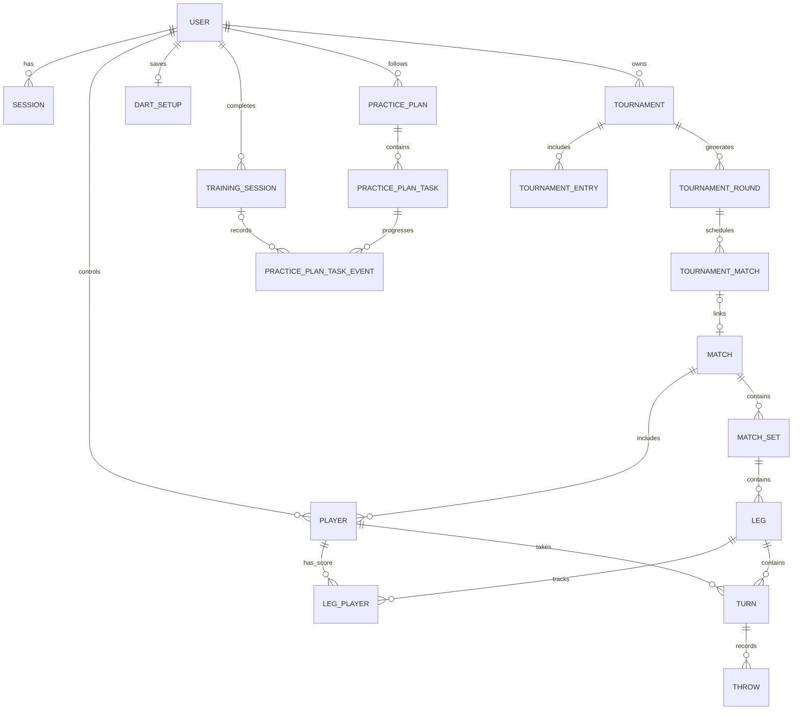

# DartZ

DartZ is a full-featured X01 darts scoring and training application built with Ruby on Rails. It supports local and remote matches, bot practice, tournaments, player statistics, structured training, and subscription-backed premium features.

The interface is mobile-friendly, available in English and Polish, and uses Hotwire for responsive updates without a JavaScript build step.

## Features

### Matches and scoring

- Two-player X01 matches for registered users or guests
- Starting scores from 101 through 701
- Configurable best-of legs and sets
- Optional double-in and double-out rules
- Server-side bust, checkout, leg, set, and match handling
- Individual dart entry from the scoring board or keyboard entry of a turn total
- Checkout suggestions, live score cards, averages, throw history, and undo
- Player order switching and automatic turn progression
- Shareable remote match invitations with QR codes, turn locking, and AFK recovery
- Real-time UI updates with Turbo Streams and Action Cable

### Bots, tournaments, and training

- Bot opponents with 10 skill levels and checkout-aware targeting
- Group, Swiss, playoff, group-to-playoff, and Swiss-to-playoff tournaments
- Single- and double-elimination playoffs, seeding, standings, live boards, and linked scored matches
- Around the Clock, Around the Clock Doubles, and Checkout Randomizer training modes
- Template, custom, and stats-generated practice plans
- Player dashboard with averages, checkout rate, high scores, wins/losses, and filters
- Saved dart setup profiles with setup-specific statistics

### Accounts and platform

- Account registration, login, password reset, and guest play
- English and Polish localization
- Light and dark themes
- Stripe Checkout and Customer Portal support for Premium and Pro plans
- JWT-authenticated JSON API for client applications
- Obfuscated public IDs for shareable resources

> Training sessions, practice plans, and dart setup tracking require premium access. Core scoring, bot matches, and guest tournaments remain available without those features.

## Tech stack

- Ruby 4.0
- Rails 8.1
- PostgreSQL
- Hotwire: Turbo and Stimulus
- Importmap and Propshaft (no Node.js toolchain required)
- Custom responsive CSS with Bulma-compatible layout utilities
- Solid Cache, Solid Queue, and Solid Cable
- Stripe, JWT, QRCode, and Rack CORS
- Minitest, Capybara, Selenium, and Testcontainers
- Docker and Kamal for deployment

## Getting started

### Requirements

- Ruby 4.0.0
- PostgreSQL
- Bundler
- Docker and Chrome only when running the opt-in E2E/system suites

### Install and run

```bash
git clone https://github.com/BartekS11/dartZ.git
cd dartZ
bin/setup --skip-server
bin/dev
```

`bin/setup` installs gems, prepares the database, and clears stale development files. The application is available at <http://localhost:3000> by default.

To reset and reseed the local database:

```bash
bin/setup --reset --skip-server
```

The repository also includes a devcontainer configuration for container-based development.

## Scoring input

Use the on-screen dart board to record an individual dart as a miss, single, double, triple, bull, or double bull. The keyboard field accepts the numeric total for the remaining darts in the current turn.

Examples:

| Input | Result |
| --- | --- |
| `26` | Record a 26-point turn total |
| `100` | Record a 100-point turn total |
| `180` | Record the maximum three-dart total |
| `Ctrl/Cmd + Z` | Undo the latest dart |

A turn contains at most three darts. All rule validation and score transitions are performed on the server.

## Tests and quality checks

Run the normal test suite:

```bash
bin/rails test
```

Run the complete local CI pipeline, including tests, RuboCop, dependency audits, and Brakeman:

```bash
bin/ci
```

Slow E2E suites are opt-in and use Testcontainers to start an isolated PostgreSQL instance:

```bash
RUN_E2E=true bin/rails test test/e2e
RUN_E2E=true bin/rails test test/system
RUN_E2E=true bin/ci
```

Docker must be running for these commands. Browser tests use Selenium with headless Chrome. When running inside the devcontainer, the E2E helper can resolve the host through Testcontainers defaults, `host.docker.internal`, the Docker gateway, or the container IP. Set `TC_HOST` or `TESTCONTAINERS_HOST_OVERRIDE` if your Docker environment needs an explicit override.

## API v1

API v1 is enabled by default and uses bearer JWTs. Set `API_V1_ENABLED=false` to disable it; disabled API routes return `503 Service Unavailable`.

Main endpoints:

```text
POST   /api/v1/auth/register
POST   /api/v1/auth/login
POST   /api/v1/auth/guest
GET    /api/v1/matches
POST   /api/v1/matches
GET    /api/v1/matches/:id
POST   /api/v1/matches/:match_id/throws
DELETE /api/v1/matches/:match_id/throws/last
```

Pass a token on protected requests:

```http
Authorization: Bearer <token>
```

## Stripe configuration

Billing can be configured through environment variables or equivalent Rails credentials:

```bash
STRIPE_SECRET_KEY=sk_test_...
STRIPE_WEBHOOK_SECRET=whsec_...
STRIPE_PREMIUM_USD_PRICE_ID=price_...
STRIPE_PRO_USD_PRICE_ID=price_...
STRIPE_PREMIUM_PLN_PRICE_ID=price_...
STRIPE_PRO_PLN_PRICE_ID=price_...
```

Create matching monthly Premium and Pro prices in Stripe for USD and PLN, enable cancellation in the Customer Portal, and send configured Stripe webhooks to:

```text
POST /stripe/webhooks
```

## Architecture

The scoring domain is organized around matches, sets, legs, turns, and throws:



Controllers delegate scoring, match creation, statistics, tournament generation, progression, billing, and training behavior to focused services and domain concerns. Presenters provide consistent match state to both HTML/Turbo views and the JSON API.

## Private operations console

The administration console uses a separate administrator account and an environment-configured URL prefix. It is intentionally absent from public navigation. Copy `.env.example` to `.env` for local development and set:

```bash
ADMIN_EMAIL=operator@example.com
ADMIN_PASSWORD=a-unique-password-of-at-least-16-characters
ADMIN_PATH=an-unpredictable-path-segment
```

Run `bin/rails db:seed` to create the initial administrator. Seeding never rotates an existing administrator. To rotate credentials later, use the Rails console:

```ruby
admin = AdminUser.first!
admin.update!(email_address: ENV.fetch("ADMIN_EMAIL"), password: ENV.fetch("ADMIN_PASSWORD"))
admin.admin_sessions.delete_all
```

Normal seeds are non-destructive. Development demo data is rebuilt only when explicitly requested with `SEED_DEMO_DATA=true`; never use that option for data you need to retain.

Manual tier overrides are audited and leave Stripe-managed account and subscription fields unchanged. Overrides remain active until cleared, and every effective downgrade requires a reason.

## Deployment

The project includes a production `Dockerfile` and Kamal configuration. Production uses PostgreSQL plus database-backed Solid Queue, Solid Cache, and Solid Cable services. Export `ADMIN_EMAIL`, `ADMIN_PASSWORD`, and `ADMIN_PATH` before running Kamal; `.kamal/secrets` forwards them without storing their values in the repository. Run migrations and then `bin/rails db:seed` once to create the initial administrator.
